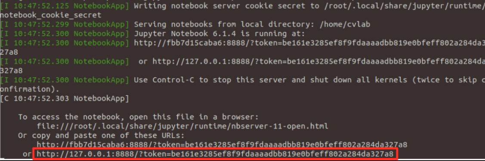

# Computer Vision and Image Processing - Lab Sessions
Clone the repository, cd to the directory with the Dockerfile and run:
```
docker build . -t cvlab
```
Run the docker container with:
```
PATH_TO_EXERCISES=/path/to/excercise
docker run -v ${PATH_TO_EXERCISES}:/home/cvlab -p 8888:8888 --device=/dev/video0:/dev/video0 -it cvlab:latest
```
This will launch automatically a jupyter notebook in the exercises directory.  
Click on the link highlighted in the following picture to open the notebook:

